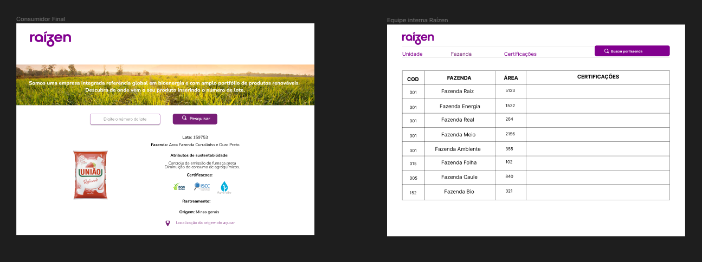

# Desafio Talent Fest - Squad 1 - Raizen

## Índice

* [1. Sobre o projeto](#1-sobre-o-projeto)
* [2. Paleta de cores](#2-paleta-de-cores)
* [3. Protótipo da interface](#3-protótipo-da-interface)
* [4. Planejamento e Organização](#4-planejamento-e-organização)
* [5. Processo de desenvolvimento da interface](#5-processo-de-desenvolvimento-da-interface)
* [6. Sobre as desenvolvedoras](#6-sobre-as-desenvolvedoras)

## 1. Sobre o projeto

Considerando o processo de açúcar, com uma produção simplificada de um produto embalado, trouxemos uma proposta de solução sistêmica que permite  que o cliente final que adquiriu o nosso produto, a partir de alguma informação na embalagem, consulte a origem da cana que resultou no produto adquirido, trazendo as respectivas informações geográficas, de rastreabilidade, atributos de sustentabilidade e certificações, onde as features apresentadas foram:

* Facilidade de navegação.
* Consulta tabular (banco de dados) das fazendas e seus atributos, permitindo o filtro por unidade, fazenda e certificações, para uso pela equipe interna da Raízen.
* Permitir consumo das informações estruturadas por meio de API para grandes clientes, baseada em chamada informando a raiz do CPNJ (8 primeiros dígitos) do cliente e período.
* Apresentação dos dados ao movimento do mouse sobre a área.

## 2. Paleta de cores

Nossa paleta de cores foi definida baseada na identidade visual da Raízen:

## 3. Protótipo da interface

Nossos protótipos foram desenvolvidos utilizando a ferramenta Figma:

## 4. Planejamento e Organização

Iniciamos o desenvolvimento do nosso projeto pelo planejamento, que consideramos uma etapa muito importante para firmarmos nossos acordos enquanto equipe, e conseguirmos encontrar as soluções requisitadas e esperadas pela Raízen.

Utilizamos a ferramenta Trello para o planejamento, onde disponibilizamos todo o material informativo para auxiliar durante a construção do nosso MVP, esmiuçamos as tarefas e dividimos as tasks.
 
Fizemos o acompanhamento periódico do código, através de pull requests e code reviews, onde ficávamos cientes de tudo o que cada uma estava desenvolvendo/colaborando, revisando e aprovando as ações para um melhor aproveitamento do tempo individual e coletivo.

## 5. Processo de desenvolvimento da interface

* Consumo de informações disponibilizadas pela Raízen.
* Levantamento de dados complementares.
* Planejamento para Sprint de 3 dias.
* Criação do Protótipo.
* Desenvolvimento do código.
* Deploy.

## 6. Sobre as desenvolvedoras

Conheça nosso super squad:

* Aghatha Euzebio [GitHub](https://github.com/AghathaK) / [Linkedin](https://www.linkedin.com/in/aghatha-silva/)
* Andresa Vieira [GitHub](https://github.com/Andresavieira28) / [Linkedin](https://www.linkedin.com/in/andresa-vieira/)
* Angélica Melo [GitHub](https://github.com/AngelMelo12) / [Linkedin](https://www.linkedin.com/in/angelicamelodev/)
* Clarissa Simplício [GitHub](https://github.com/clasimplicio) / [Linkedin](https://www.linkedin.com/in/clarissasimpl%C3%ADcio/)
* Luciana Chamma [GiHub](https://github.com/LucianaChamma) / [Linkedin](https://www.linkedin.com/in/luciana-sahd-chamma-baptista/)

